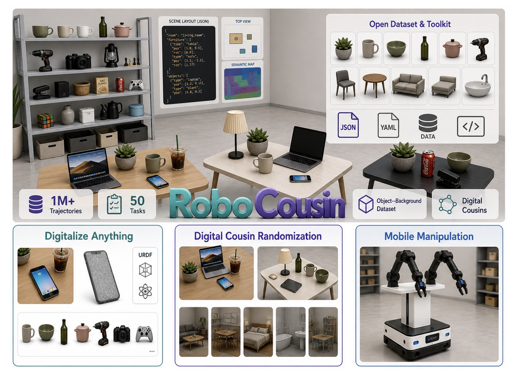
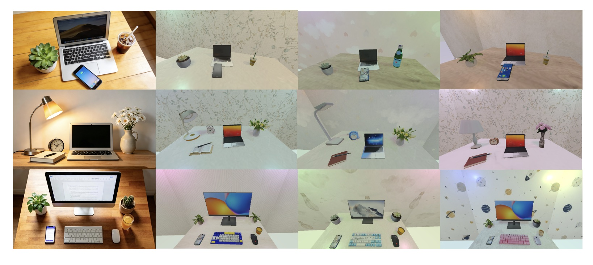

# RoboCousin

[English](./README.md)

RoboCousin 基于 [RoboTwin](https://github.com/RoboTwin-Platform/RoboTwin) 扩展，
用于结合自定义物体和真实场景布局构建桌面操作数据集。

本仓库主要覆盖三条工作流：

- 处理自定义 3D 资产并生成抓取接触点；
- 生成房间布局，并在仿真环境中采集操作轨迹；
- 从单张 RGB 图片重建相对桌面布局，并在 RoboTwin 中预览或执行。

RoboCousin 目前主要面向抓取、放置等上肢桌面操作任务。移动底盘导航以及策略训练、评测工作流即将推出，敬请期待。

<p align="center">
  
</p>

## 目录

- [安装](#安装)
- [快速开始](#快速开始)
- [自定义资产处理](#自定义资产处理)
- [基于房间布局的数据采集](#基于房间布局的数据采集)
- [Desk Cousin：从图片生成布局](#desk-cousin从图片生成布局)
- [可选的 3DGENERATION 集成](#可选的-3dgeneration-集成)
- [仓库结构](#仓库结构)
- [故障排查](#故障排查)
- [致谢](#致谢)

## 安装

### 前置条件

- Linux、NVIDIA GPU，以及与 RoboTwin 兼容的 CUDA/PyTorch 环境
- Conda 或其他 Python 环境管理工具
- Python 3.10
- 支持 Git 子模块的 Git 版本
- 用于导出视频的 `ffmpeg`
- 在 X11 环境中调整查看器窗口位置时使用的 `xdotool`

底层仿真环境的详细要求请参阅 [RoboTwin 安装文档](https://robotwin-platform.github.io/doc/usage/robotwin-install.html)。

### 1. 克隆仓库并初始化子模块

```bash
git clone --recurse-submodules https://github.com/Tele-DLife/RoboCousin.git
cd RoboCousin

# 如果克隆时没有使用 --recurse-submodules，执行下面的命令即可补全。
git submodule update --init --recursive
```

可选的“图片到布局”工作流依赖 PerspectiveFields、Depth-Anything-V2、
GroundingDINO、SAM 2 和 PyTorch3D 子模块。

### 第三方组件的取得与许可

初始化子模块以及运行安装或下载脚本时，用户的本地环境可能会直接从第三方仓库和
服务获取相关组件。相关组件由用户从对应第三方取得；使用前，请审阅并遵守上游许可
条款。如组件要求注册账户、接受许可协议或申请访问权限，请由用户直接向相应第三方
完成。

**PerspectiveFields** 适用 Adobe Research License Terms，仅可用于研究、教学和
测试等非商业目的，且不得再分发其 Research Materials。请在确认拟定用途符合上述
条款后，直接从上游项目初始化或取得该组件。

RoboCousin 的原创部分采用 MIT License。第三方组件仍适用其自身条款，不会被
RoboCousin 重新许可。详情请参阅[第三方声明](./THIRD_PARTY_NOTICES.zh-CN.md)。

默认深度估计模块使用需单独下载的
[Depth Anything V2 Metric Hypersim Large](https://huggingface.co/depth-anything/Depth-Anything-V2-Metric-Hypersim-Large)
权重；其官方模型仓库采用 Apache-2.0。

### 2. 创建 Python 环境

```bash
conda create -n robocousin python=3.10 -y
conda activate robocousin
```

### 3. 安装依赖

```bash
bash script/_install.sh
```

安装脚本会：

- 安装 `script/requirements.txt`；
- 安装匹配和渲染相关依赖；
- 安装或更新 PyTorch3D 与 cuRobo；
- 应用 RoboCousin 运行所需的 SAPIEN 和 mplib 补丁；
- 提示缺失的可选系统工具与子模块。

该脚本会修改当前 Python 环境中安装的软件包文件，因此建议为 RoboCousin 使用独立环境。

Ubuntu 用户可以安装以下可选系统依赖：

```bash
sudo apt-get update
sudo apt-get install -y ffmpeg xdotool
```

### 4. 下载仿真资产

运行以下脚本，下载机器人本体、内置物体和背景纹理：

```bash
bash script/_download_assets.sh
```

启用 `use_custom_objects` 前，请将 `examples/custom_assets/` 下的示例复制到
`our_assets/`：

```bash
mkdir -p our_assets/actor
cp -r examples/custom_assets/actor/apple our_assets/actor/
```

完整文件布局见[自定义资产示例说明](examples/custom_assets/README.zh-CN.md)。

## 快速开始

`demo_complete` 默认启用 `use_custom_objects`。完成上面的示例复制后，运行：

```bash
python script/collect_data_complete.py pick_up demo_complete
```

如不使用自定义资产，请在 `task_config/demo_complete.yml` 中关闭
`use_custom_objects`，或改用其他任务配置。

任务行为由 `task_config/demo_complete.yml` 控制。通用 RoboTwin 配置项请参阅 [RoboTwin 使用文档](https://robotwin-platform.github.io/doc/usage/index.html)。

## 自定义资产处理

每个自定义物体实例应放在 `our_assets/<类别>/<名称>/<编号>/` 下，并至少包含
URDF、接触点数据和网格文件：

```text
our_assets/
  actor/
    apple/
      0/
        sample.urdf
        model_data.json
        mesh/
          sample.obj                 # 或 sample.glb
          sample_collision.obj       # 或 sample_collision.glb
      1/
      2/
      3/
      4/
  non-actor/
    laptop/0/
      sample.urdf
      model_data.json
      mesh/
        sample.obj                 # 或 sample.glb
        sample_collision.obj       # 或 sample_collision.glb
  room/
    desk/1/
      sample.urdf
      model_data.json
      mesh/
        sample.glb
```

- `sample.urdf`：仿真加载配置和网格缩放信息（必需）
- `model_data.json`：接触点、缩放比例和包围盒尺寸（抓取自定义物体时必需）
- `mesh/`：视觉网格和碰撞网格；OBJ 格式可能还包含 `material.mtl` 和纹理文件

仓库在 `examples/custom_assets/actor/` 下提供了多组可直接复制的 `actor`
类别示例。默认的 `apple` 示例包含编号 `0` 到 `4` 的五个实例；此外还提供电池、
瓶装饮料、盒子、罐头食品、马克笔、橙子和玩具示例。可按上文安装步骤将所需类别
复制到 `our_assets/actor/`。

仓库还在 `examples/custom_assets/non-actor/` 下提供相机、电脑显示器、键盘和
笔记本电脑示例，可直接复制到 `our_assets/non-actor/`。

新导入的可抓取物体如果没有 `model_data.json`，需要先生成接触点数据。

处理全部自定义资产：

```bash
python script/auto_generate_contact_points.py --all
```

只处理一个资产分支：

```bash
python script/auto_generate_contact_points.py \
  --assets_branch_dir our_assets/actor
```

处理单个资产实例：

```bash
python script/auto_generate_contact_points.py \
  --object_dir our_assets/actor/coke/0 \
  --height_ratio 0.6 \
  --vertical_ratio 0.3
```

命令会在处理后的每个实例目录中生成 `model_data.json`。如需覆盖已有文件，
请添加 `--no_skip_existing_model_data`。

不同任务对自定义物体的支持有所不同。适配新的资产类别时，建议先参考
`pick_up`、`place_bread_basket` 和 `place_object_stand`；其他任务可能还需要
调整抓取动作、放置动作和成功条件。

## 基于房间布局的数据采集

主要入口为 `script/collect_data_complete.py`：

```bash
python script/collect_data_complete.py TASK_NAME CONFIG_NAME [options]
```

常用参数包括：

- `--room-type`：选择 `livingroom`、`bedroom` 或 `diningroom` 等房间类别；
- `--room-layout-index`：选择该房间类别下的布局；
- `--room-layout-json`：读取指定的布局 JSON；
- `--generate-room-layout --room-prompt`：在采集前生成房间布局；
- `--use-cousin-coordinate`：使用 Desk Cousin 工作流生成的布局；
- `--render-freq`：控制采集过程中的渲染频率。

对于 `threeD-generation/obj/` 下准备好的物体，也可以使用兼容脚本
`threeD-generation/run_obj_data_collection.py`，依次完成接触点生成、配置创建和
数据采集：

```bash
python threeD-generation/run_obj_data_collection.py --room-type livingroom
```

## Desk Cousin：从图片生成布局

该可选工作流从单张 RGB 图片中估计桌面物体的相对布局，并将检测到的物体与本地
`our_assets` 匹配。随后，流程会确定各实例的朝向和堆叠支撑关系，导出可在
RoboTwin 中预览或执行的布局。

该流程基于 [Digital Cousins](https://github.com/cremebrule/digital-cousins)
的真实场景提取流程，并增加了 RoboTwin 资产匹配、结合相机视角的物体朝向选择，
以及显式的 `ontop` 支撑关系图。

保留或改编自 Digital Cousins 的组件仍受 Apache License 2.0 约束。
RoboCousin 修改过的文件会在源码文件头中注明，具体范围和许可证文本参见
[第三方声明](./THIRD_PARTY_NOTICES.zh-CN.md)。

<p align="center">
  
</p>

### 额外前置条件

1. 按前文说明初始化所有 Git 子模块。
2. 将所需模型权重下载到本地目录。
3. 通过环境变量指定权重目录：

```bash
export COUSIN_LAYOUT_CHECKPOINT_DIR=/path/to/checkpoints
```

4. 如需使用图像描述或重标注功能，请在
   `cousin_layout/configs/local_keys.yaml` 中配置 API Key：

```yaml
pipeline:
  RealWorldExtractor:
    call:
      gpt_api_key: YOUR_API_KEY
```


### 生成布局

```bash
python cousin_layout/scripts/image_to_relative_layout_with_matching.py \
  --input-image-path /path/to/desk.png \
  --save-dir cousin_layout/desk_layout/my_run \
  --snapshot-overwrite \
  --verbose
```

主要输出包括：

- `step_1_output_info.json`；
- `relative_layout/relative_layout_ontop_desktable.json`。

常用参数：

- `--semantic-model bert|qwen`：选择类别名称匹配后端；
- `--snapshot-step-degrees`：控制朝向搜索的角度间隔；
- `--snapshot-distance-factor`：控制快照相机距离；
- `--support-footprint-slice-frac`：调整高瘦或不规则物体的支撑关系判断。

### 预览布局

```bash
python script/preview_cousin_layout.py \
  --task-config demo_complete \
  --input_layout cousin_layout/desk_layout/my_run/relative_layout/relative_layout_ontop_desktable.json
```

如需从 UI 调用，可使用兼容脚本：

```bash
python threeD-generation/preview_cousin_layout_ui.py \
  --input_layout cousin_layout/desk_layout/my_run/relative_layout/relative_layout_ontop_desktable.json
```

可选的查看器设置：

```bash
export ROBOTWIN_VIEWER_RES=960,540
export ROBOTWIN_VIEWER_PLACEMENT=bottom_left
export ROBOTWIN_VIEWER_MINIMAL_UI=1
```

### 使用生成的布局采集数据

在 `task_config/demo_complete.yml` 中设置：

```yaml
use_cousin_coordinate: true
cousin_target_labels: [OBJECT_LABEL]
cousin_relative_layout_json: cousin_layout/desk_layout/my_run/relative_layout/relative_layout_ontop_desktable.json
```

然后运行：

```bash
python script/collect_data_complete.py pick_up demo_complete
```

## 可选的 3DGENERATION 集成

RoboCousin 仅在 `threeD-generation/` 下提供与
[3DGENERATION](https://github.com/Tele-DLife/3DGENERATION) 对接的兼容脚本，
不包含 3DGENERATION WebUI。英文和中文 WebUI 入口分别位于
[3DGENERATION 仓库](https://github.com/Tele-DLife/3DGENERATION)的
`apps/app_demo_Eng.py` 和 `apps/app_demo_CHN.py`。

如果本地同时部署了 3DGENERATION，可在该项目中配置 RoboCousin 仓库路径，
用于调用资产提取与同步、Desk Cousin 布局生成、场景预览和数据采集功能。
两个仓库可以放在任意位置，不要求使用固定的 `/home/...` 目录结构。

两个项目通过生成的 `relative_layout_ontop_desktable.json` 交换布局结果。
RoboCousin 的命令行工作流不依赖 3DGENERATION WebUI。

## 场景渲染与导出

渲染生成的场景：

```bash
python threeD-generation/ui_generated_scene_render_ui.py --steps 200
```

导出为 GLB：

```bash
python threeD-generation/ui_generated_scene_render_ui.py \
  --export \
  --export-path outputs/scene_export.glb
```

## 仓库结构

```text
RoboCousin/
  assets/                 # 下载得到的 RoboTwin 运行时资产
  cousin_layout/          # 图片提取、资产匹配和布局生成
  deps/                   # 以子模块形式引入的外部模型仓库
  envs/                   # 仿真任务和环境工具
  our_assets/             # 自定义物体资产
  script/                 # 安装、处理、预览和采集脚本
  task_config/            # 公开任务配置
  threeD-generation/      # RoboCousin 侧的兼容与渲染脚本
```

## 故障排查

- **子模块导入失败：**运行 `git submodule update --init --recursive`，并确认所需仓库存在于 `deps/`、`PerspectiveFields/` 或 `envs/pytorch3d/`。
- **找不到机器人、物体或纹理：**运行 `bash script/_download_assets.sh`，并检查 `assets/` 下的下载目录。
- **Desk Cousin 找不到模型：**检查 `COUSIN_LAYOUT_CHECKPOINT_DIR` 和所需权重文件名。
- **视频导出失败：**确认可以从 `PATH` 调用 `ffmpeg`。
- **查看器窗口位置设置无效：**安装 `xdotool`；该功能只适用于受支持的 X11 会话。
- **首次运行较慢：**模型初始化和本地缓存可能需要较长时间。

提交问题时，请提供运行命令、任务配置名称、Python/CUDA/PyTorch 版本以及完整错误堆栈。不要附带 API Key 或私有数据集路径。

## 致谢

RoboCousin 基于或参考了以下项目和组件：

- [RoboTwin](https://github.com/RoboTwin-Platform/RoboTwin)
- [Digital Cousins（ACDC）](https://github.com/cremebrule/digital-cousins)及其
  [论文](https://arxiv.org/abs/2410.07408)
- [Grounded-SAM-2](https://github.com/IDEA-Research/Grounded-SAM-2)
- [Depth-Anything-V2](https://github.com/DepthAnything/Depth-Anything-V2)
- [PerspectiveFields](https://github.com/jinlinyi/PerspectiveFields)
- [DINOv2](https://github.com/facebookresearch/dinov2)

使用本项目时，请引用与你的工作相关的上游项目；如使用了自定义资产处理、Desk Cousin 或 RoboTwin 集成功能，也请引用 RoboCousin。

## 许可证

RoboCousin 的原创代码采用 [MIT License](./LICENSE)。基于第三方项目修改或衍生的部分仍遵循其原始许可证，详情参见[第三方声明](./THIRD_PARTY_NOTICES.zh-CN.md)。

RoboCousin 原创贡献的 MIT License 不会替代仓库中包含、链接或要求用户另行下载的依赖、模型权重及资产的原始许可证。尤其需要注意，PerspectiveFields 仅限非商业用途，且禁止再分发其 Research Materials。
